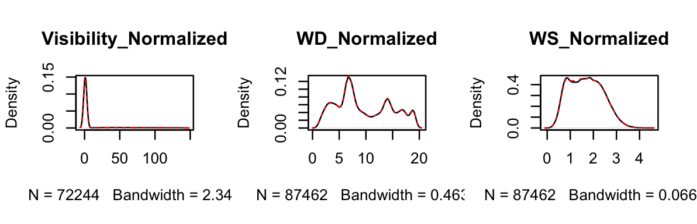

```{r knitr_settings, eval=TRUE, echo=FALSE, cache=FALSE}
knitr:: opts_chunk$set("tidy" = FALSE)
knitr:: opts_chunk$set("echo" = FALSE)
knitr:: opts_chunk$set("eval" = TRUE)
knitr:: opts_chunk$set("warning" = FALSE)
knitr:: opts_chunk$set("cache" = FALSE)

inline_hook <- function(x){
	print(x)

	if(is.list(x)){
		x <- unlist(x)
	}

	if(is.numeric(x)){
		if(abs(x - round(x)) < .Machine$double.eps^0.5){
			paste(format(x,big.mark=',', digits=0, scientific=FALSE))
		} else {
			paste(format(x,big.mark=',', digits=1, nsmall=1, scientific=FALSE))
		}
	} else {
    	paste(x)      
	}
}
knitr::knit_hooks$set(inline=inline_hook)
```

\vspace{35mm}

Running title: INSERT RUNNING TITLE HERE

\vspace{35mm}

Munkh\^1, Joeseph P. Schmo\^2, Sally J. Rivers\^1, Patrick D.
Schloss^1^$\dagger$

\vspace{40mm}

$\dagger$ To whom correspondence should be addressed:
[pschloss\@umich.edu](mailto:pschloss@umich.edu){.email}

1\. Department of Microbiology and Immunology, University of Michigan,
Ann Arbor, MI 48109

2\. Other department contact information

\newpage
\linenumbers

## Abstract (150 words)

Storyline:

1.  A new pattern is emerged
2.  Air quality in urban sites is episodically dictated by dust events
    in spring or late autumn, yet seasonally governed by anthropogenic
    emissions in winter. [Air quality is governed by natural dust
    emission, and anthropogenic emissions]
3.  With recent growing interest in urban life style, and combustion of
    coal/oyutolgoi for heating winter conditions results a highly
    increase in not only capital city but also towns
4.  In a result, spring coarse dust, plus winter fine pollutants
5.  spring coarse dust is immediately transported and deposited in the
    source area, whereas winter fine pollutants is permanently stayed in
    the source area due to stagnant atmosphere govern over entire
    country., perhaps floating in the near surface, deposits in the
    surface]
6.  Alarms, the Mongolian dust in the spring, optical properties might
    be shifted; this gives ... Gobi dust and sand storms has become
    tuiren, from the shoroon shuurga. which clearly requires the
    attention.
7.  r ratio shows ... emission source; dust might carry anthropogenic
    fine particulates as well. \newpage


## Introduction
    * Advanced the knowledge of global dust, has reached to recognize the sources,.
      - Classification dust brown color, seasonal characteristics, with coarse fractions.
      - This knowledge further efficient to climate system when elaborating dust-aerosol effects.
      - But, a large uncertainties in the global dust model has existed so for climate models which clearly limits our understanding the climate system and shape the facing global issues of global warming.
      - This is mainly caused by the lack of parameterization and recognition of iterative changes controlled by the natural forces and anthropogenic drivings.

    * Mongolian dust brown color, seasonal characteristics, with coarse fractions.
      - Mongolian dust has an attention of the its mass fraction in global dust, yet unlikely elaborated in the climate models due to its majority of coarse fraction for its a small contribution to the climate system through its radiative feedback.
      - But, such recognized characterization might get no longer valid due to recent change in the driving of the emissions of air particulate matters. A large high concentrations of PM2.5 in the capital city of Mongolia has been observed  as a result of the heavy consumptions of coal as a winter heating has rapidly spread as a mining industry taken off since 2000. Winter weather stagnant conditions governed by the Siberian magnifies the concentrations of the particulate matter emissions by trapping the polluted air below the boundary layer, so that results in a very large high concentrations of PM2.5, locally. Even  recognized as one of the highly polluted capital cities in the world.
      - Therefore, It is important to examine the emerging changes and shifting patterns of air particulate matters in Mongolia. More importantly, it is essential to reveal the significant changes in the the altered fraction particularly, in the dust seasons considering its high potential of intriuging in the free atmosphere to transported in the long-distance, so carrying capacity of the role to shift the global climate system, and its side impacts on downwind regions.

* Study goal
      - We hypothesize ...
      - Our study will benefit not only to the global dust research but also climate, and further to the country itself for urban planning, and coal combustion.


## Research Qs
Therefore, we aimed to demonstrate the distinct temporal and spatial
variations of PM2.5 and PM10 across urban and rural Mongolia using
extensive data from 2008 to 2020.

On spring, the dust storm from the Gobi Desert contribute
significantly to increased aerosols in the atmosphere and ambient
air pollution, leading to sporadic peaks in PM10 concentrations
reaching as high as 64-234 $\mu g m^{-3}$ per day or exceeding 6000
$\mu g m^{-3}$ per hour (Jugder).
concentrations of particulate matter is ephederemal, yet vary
    depending on whether the pollution cause is natural or industrial,
    local or transported, seasonal or non-seasonal, makes complex and
    challenging.
    1.  Do concentrations of particulate matters differ in between urban
        and rural sites, and even within Gobi sites?
    2.  Do distinct temporal variations has existed among the sites?
    3.  Do PM2.5 particulates has contributed to the PM10 annual
        variations?

    -   If yes, how much, and when and where?
    -   What is the sd, mean, and median
        -   box plot
        -   violin
        -   scatter points, epidemic, sporadic
    -   Daily variations to examine it related to the heating
        -   2 peaks: smaller and bigger
        -   compare the t-duration exceeds 50mug/m3/hour

    4.  Does it has distinct patterns among the sites regarding to the
        drivings

    -   How PMs varies with the wind speed and visibility
    -   Do they differently explained with variables and changes in
        drivings (with PCA analysis)

    5.  Is there any significant changes in time-series of PMs at 4
        seasons
    6.  Is there any significant changes in ratio in the spring in
        respect to winter?

        The present study will contribute significantly to the understanding
            of air particulate matter patterns in Mongolia and providing
            comprehensive data insights for policymakers and public health
            sectors. Our findings is useful not only for addressing national health
            impacts but also beneficial for understanding air particulate matter
            as ambient air pollution, and tackling atmospheric aerosol effects
            in the climate system, and revealing their transboundary effects to
            the downwind regions in South-east Asia.


## Results
### The spatio-temporal variations of the PMs at the study sites
To comparatively examine the spatio-difference regarding to the emissions of PMs, we illustrated the hourly observed values of PM10 and PM2.5 for all sites (figure_3). On each site, PM10 is more sporadic than PM2.5 due to dust epidemic nature. In conjunction, the mean values averaged from hourly values are larger than its median concentrations both on PM10 and PM2.5 for all sites. The mean variables of p-value show that concentrations of particulate matters significantly differ with 99% confident levels at all sites (figure_3), except  95% confident level between DZ and UB on PM10 (figure_3a). It clearly exhibits general variations of particulate matters as expected and emphasizes that the significant difference in the concentration values among the sites. Besides all sites are quantitatively differ by the values of concentrations in particulate matters, there are two main characteristics can be seen when we compare the median deviations from its mean values etc.

- such patterns are strongly manifested in ZU and SS sites.  
- the mean values those averaged from hourly concentrations of PM10 and PM2.5 is larger than its median are strongly manifested for all in UB and DZ sites.
- Additionally, consider the significance of the ..

This highlight that the fine and coarse particulate matters significantly vary among sites of urban and rural sites, and even within Gobi (rural) sites.
Moreover, .... has a diversely characteristically diversified in respect with the PM2.5 (fine) to PM10 (coarse) particulates.,. which requires urban impacts


To reveal the natural and anthropogenic impacts on the concentrations of particulate matters, we demonstrated annual variations of PM10 and PM2.5 for each sites (figure_4).
3.  Do PM2.5 particulates has contributed to the PM10 annual
    variations?
      Distinct temporal variations has existed among the sites.
        -   PM2.5 particulates has contributed to the PM10 annual
            variations in UB and in DZ in winter.
            -   If yes, how much, and when and where?
            -   What is the sd, mean, and median
                -   box plot
                -   violin
                -   scatter points, epidemic, sporadic
            -   Daily variations to examine it related to the heating
                -   2 peaks: smaller and bigger
                -   compare the t-duration exceeds 50mug/m3/hour


[Therefore] SS and ZU sites are mainly affected by the spring dust, followed by the autumn dust. Annual maximum in the winter for DZ and UB are from PM2.5, which results an increase in PM10.
It requires the cause the behind such the variations. DZ site is polluted in the winter by the heating and in the spring by the natural dust.


[Therefore] Spatio-temporally in two class; consists of 2 Gobi sites, and 1 urban plus urbanized Gobi sites.


### The emission patterns of interrelations among meteorological variables at the study sites

        -   PMs varies with the wind speed and visibility
        -   In general, three distinct patterns were resulted with PCA
            analysis, which is in consistent with temporal variation.
            explained with variables and changes in drivings (with PCA
            analysis)


DZ site is polluted in the winter by the heating and in the spring by the natural dust.

### The recent trends in concentrations of PMS and fine-coarse

        fractional changes at the sites
        -   There are significant changes in time-series of PMs at 4
            seasons
        -   There any significant changes in ratio in the spring in
            respect to winter in DZ.
        -   Close relationships was found between PM2.5 in winter and r
            values in the spring.

## Conclusions

-   The spatio-temporal variations of the PMs at the study sites
        -   Concentrations of particulate matters differ in between
            urban and rural sites, and even within Gobi sites.
        -   Distinct temporal variations has existed among the sites.
        -   PM2.5 particulates has contributed to the PM10 annual
            variations in UB and in DZ in winter.
            -   If yes, how much, and when and where?
            -   What is the sd, mean, and median
                -   box plot
                -   violin
                -   scatter points, epidemic, sporadic
            -   Daily variations to examine it related to the heating
                -   2 peaks: smaller and bigger
                -   compare the t-duration exceeds 50mug/m3/hour
    -   The emission patterns of interrelations among meteorological
        variables at the study sites
        -   PMs varies with the wind speed and visibility
        -   In general, three distinct patterns were resulted with PCA
            analysis, which is in consistent with temporal variation.
            explained with variables and changes in drivings (with PCA
            analysis)
    -   The recent trends in concentrations of PMS and fine-coarse
        fractional changes at the sites
        -   There are significant changes in time-series of PMs at 4
            seasons
        -   There any significant changes in ratio in the spring in
            respect to winter PM2.5 in DZ.
    -   Close relationships was found between PM2.5 in winter and r
        values in the spring. Thus, our research results clearly proves
        the distinct variations in PMs has emerged. The dust fine-coarse
        fractions was manifested at the town center for the Gobi sites,
        which reveals the that Mongolian dust composites not only coarse
        dust, but also fine particulate matters. The particulates likely
        consisted of the black carbon, which may give a substantial
        effect on climate systems. if this trend continues on as coal
        consumption with the population growth in the future.
    -   CO Carbon monoxide is obtained due to incomplete combustion of
        charcoal in a closed room.
    -   CO2

\newpage

## Results and Discussion

\newpage
\subsection{Urban and rural distinct Spatio-temporal diverse variations of $PM_{10}$ and $PM_{2.5}$}

{width="300"}

1.  Compare the concentrations of PMs at UB is the 2. Significance level
    difference 3. Conclude

\newpage

{width="330"}

1.  Clear annual variations at UB and DZ from pm2.5 pollutions 2. at ZU,
    and SS has a seasonally peaks episodic spring and late autumn from
    PM10

\newpage

{width="300"}

\newpage
\subsection{Meteorological influence on $PM_{10}$ and $PM_{2.5}$ variations}
\label{subsec2}

{width="300"}

\newpage

{width="200"}

{width="200"}

\newpage
\subsection{Trends}

{width="300"}

\newpage

## Conclusions

In this study, we investigated the temporal variations of PM2.5 and PM10
concentrations at the 4 sites of rural and urban those located along the
the wind corridor. Three distinct variations has been detected.

\begin{enumerate}
    \item Air quality in urban sites is episodically dictated by dust events in spring or late autumn, yet seasonally governed by anthropogenic emissions in winter.
    \item Air quality in rural sites of SS and ZU is episodically dictated by dust events in spring or late autumn.
    \item Air quality in rural sites of SS and ZU is episodically dictated by dust events in spring or late autumn.
\end{enumerate}

A clear seasonal variations in the sites of UB and DZ is [Air quality is
governed by natural dust emission, and anthropogenic emissions] \* Due
to rapid increase in urban, and combustion of coal/oyutolgoi for heating
winter conditions results a highly increase in not only capital city but
also towns \* In a result, spring coarse dust, plus winter fine
pollutants [spring coarse dust is immediately transported and deposited
in the source area, whereas winter fine pollutants is permanently stayed
in the source area due to stagnant atmosphere govern over entire
country., perhaps float- ing in the near surface, deposits in the
surface] \* Alarms, the Mongolian dust in the spring, optical properties
will be shifted; this gives ... Gobi dust and sand storms has become
tuiren, from the shoroon shuurga. which clearly requires the attention.

Following problems

-   On downwind regions
-   On national-level Demonstrating temporal and spatial variations of
    air particulate matter has become important for understanding
    characteristics of particulate matter in the climate system,
    providing valuable information for well-established air quality
    measures, and illustrating the good trace data for health studies.
    Because particulate pollutants have a great impact on human health
    (Dockery and Pope,1994; Harrison and Yin, 2000; Hong et al., 2002),
    high atmospheric concentrations of these pollutants was a major
    concern particularly in urban areas, in the last 2-3 decades. Recent
    studies highlight that even low concentrations of these pollutants
    can lead to various health issues, and may associate with morbidity
    and mortality across the life span (Zigler et al., 2017). Children
    exposed to high levels of air pollution show increased rates of
    asthma, decreased lung function growth, and increased risk of early
    markers of cardiovascular disease (Bourdrel et al., 2017; Gauderman
    et al., 2015; Hehua et al., 2017). Short-term exposure with high
    level of PM10 resulted the chronic cardiovascular disease in
    Mongolia (Enkhjargal 2020). In addition to these health issues,
    (prenatal) neurodevelopmental impacts such as effects on
    intelligence, attention, autism, and mood, while aging populations
    experience accelerated cognitive decline when exposed to high levels
    of pollution is detected (Power et al., 2016). Long-term exposure to
    low levels of particulate matter, such as concentrations as low as
    10 $\mu g m^{-3}$ (equilibrium to WHO Air Quality Guidelines), has
    been linked to increased lung cancer in the EU (Hvidtfeldt et al.
    2021), with similar evidences reported in Canada (Bai et al., 2019),
    and significantly higher rates captured in China with concentrations
    up to 30 $\mu g m^{-3}$. Apparently, pollutants of particulate
    matters has effects to various health issues with the different
    thresholds and exposure durations. However, more in-depth and
    diversified research on air pollution and its health effects is
    essential, with the detailed information is necessary (Tan et al
    2021) to have accuracy of assessing exposure to air pollution during
          developmentally relevant time periods, such as trimesters or
          months (Becerra et al., 2013; Gong et al., 2014; Kalkbrenner
          et al., 2014) or weeks (Chiu et al., 2016). Many research
          findings/Numerous research findings have advanced the field,
          and air quality indices is widely used for providing guidance,
          and public perception of air quality has been improved
          (Mirabelli et al., 2020).

\newpage

## Materials and Methods

### Materials

### Methods  3,000 words

## Acknowledgements
Keep acknowledgements brief and do not include thanks to anonymous referees or editors, or effusive
comments. Grant or contribution numbers may be acknowledged.

## Figures (10)
Figure legends should be <350 words each. They should begin with a
brief title sentence for the whole figure and continue with a short
statement of what is depicted in the figure, not the results (or data) of
the experiment or the methods used. Legends should be detailed enough
so that each figure and caption can, as far as possible, be understood in
isolation from the main text.

Tables. Each table should be prepared using the Table menu in Word or
the table environment in TeX/LaTeX and accompanied by a short title
sentence describing what the table shows. Further details can be
included as footnotes to the table.


## References (70)

## Supplementary
Author contributions. You must include a statement that specifies the
individual contributions of each co-author. For example: "A.P.M.
‘contributed’ Y and Z; B.T.R. ‘contributed’ Y,” etc. See our authorship
policies for more details.

Competing interests. Submission of a competing interests statement is
required for all content of the journal.

Materials & Correspondence. Indicate the author(s) to whom
correspondence and material requests should be addressed.

Supplementary information
Please submit supplementary figures, small tables and text as a single
combined PDF document. Tables longer than one page should be
provided as an Excel or similar file type. For optimal quality video files
please use H.264 encoding, the standard aspect ratio of 16:9 (4:3 is
second best) and do not compress the video. We encourage submission
of step-by-step synthesis procedures for chemical compounds and data
on compound characterization. Supplementary information is not copyedited, so please ensure that it is clearly and succinctly presented, and
that the style and terminology conform to the rest of the manuscript.

## Materials and Methods

### A description of study sites

According to the spatial magnitude of wind stress in Mongolia (Figure
1), the largest magnitude of wind speed is on the Gobi sites,
particularly those located in the southeast edge of the country.

-   The impact of high winds on plant diversity varies across
    environmental gradients of precipitation and soil fertility
    (Milchunas et al., 1988).
-   In the desert steppe zone, species richness was lower in the drier
    years but did not vary with grazing pressure.
-   In the steppe zone, species richness varied significantly with
    grazing pressure but did not vary between years. Species richness is
    not impacted by grazing gradient in desert steppe, but it is in the
    steppe (Cheng et al., 2011).

In the last 2 decades, due to poverty and natural disasters there is
population immigration has taken place from the rural to urban,
especially to capital city of Mongolia. Due to tiny infrastructure to
provide the mega city with the dense population, it introduces the urban
pollution. Therefore, Ulaanbaatar air particulate matter mainly reflects
the coal burning, and partly, natural dust.

Consequently, the atmospheric environment and climate for Mongolian Gobi
has been impacted the most by frequent dust and and sand storm in the
spring.

Our study was carried out in Dalanzadgad (town center) (Tbl. 1; 43.57°N,
104.42°E), Sainshand (Tbl. 1; 44.87°N, 110.12°E) and Zamyn-Uud (Tbl. 1;
43.72°N, 111.90°E) in the Gobi Desert, and at Ulaanbaatar (Tbl.??.??°N,
104.42°E) (city center) located in the temperate Mongolian steppe of
Mongolia (Figure 2). Nomads and settlements of this sum have raised a
large number of livestock, and they rank at number 30 out of 329 sums
for the largest number of livestock raised per sum (Saizen et al.,
2010). In the last decade, the number of dust events associated with
wind erodibility increased by 30 % in Bayan-Önjüül (Kurosaki et al.,
2011). This is an area where dust emissions activity has been monitored
on a long-term basis (Shinoda et al., 2010a) at a dust observation site
(DOS) adjacent to the study site (Fig. 1a). According to long-term
meteorological observations made at the monitoring station of the
Institute of Meteorology and Hydrology of Mongolia located near the
site, the prevailing wind direction is northwest. Mean annual
precipitation is 163 mm, and mean temperature is 0.1◦C for the period
1995 to 2005 (Shinoda et al., 2010b). Soil texture is dominated by sand
(98.1 %, with only 1.3 % clay and 0.6 % silt; Table 1; Shinoda et al.,
2010a). Insert figure legends with the first sentence in bold, for
example:

\newpage

{width="300"}]

{width="400"}

\newpage

{width="300"}

\newpage

{width="300"}

{width="300"}

\newpage

## References
